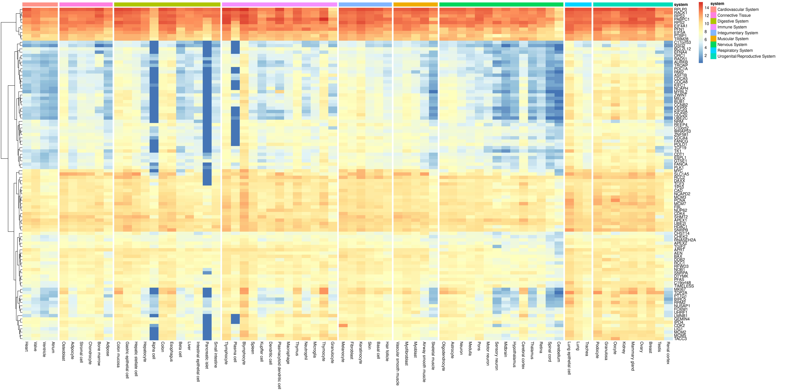
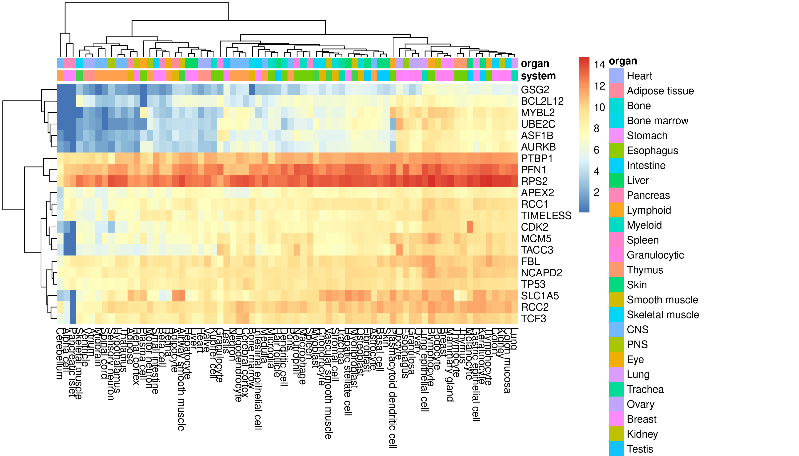

# Gene heatmap using ARCHS4

Create a gene heatmap using data from [ARCHS4](https://maayanlab.cloud/archs4/). The example below retrieves the top 100 (default) most correlated gene expression patterns with _TP53_ using `gget` and plots the results in a heatmap.

```console
./script/plot_heatmap.sh -p 10 TP53
```



Top 20 most correlated.

```console
./script/plot_heatmap.sh -p 10 -n 20 TP53
```



## Usage

Run the script without any commands to get the usage.

```console
./script/plot_heatmap.sh
Usage: ./script/plot_heatmap.sh
   [ -p | --max-procs INT (default 8)]
   [ -t | --tmp-dir STR (default /tmp)]
   [ -k | --keep keep tmp files]
   [ -s | --species STR (default human)]
   [ -n | --num-genes INT (default 100)]
   [ -v | --version ]
   [ -h | --help ]
   <HGNC gene symbol>
```

## Dependencies

The script requires [gget](https://github.com/pachterlab/gget).

```console
pip install --upgrade gget
```

The heatmap is plotted using R and the following packages are required for the `heatmap.R` script.

```r
install.packages(c("optparse", "pheatmap", "dplyr", "tidyr"))
```

## Docker

A Docker image with all the dependencies has been created.

```console
docker pull davetang/archs4_heatmap:4.4.1
```

Run the example, which will fetch the 100 most correlated genes to TP53 from ARCHS4, and plot the results as a heatmap.

```console
docker run --rm -v $(pwd):$(pwd) -w $(pwd) davetang/archs4_heatmap:4.4.1 -p 4 TP53
```

## Contact

Email <me@davetang.org>.
