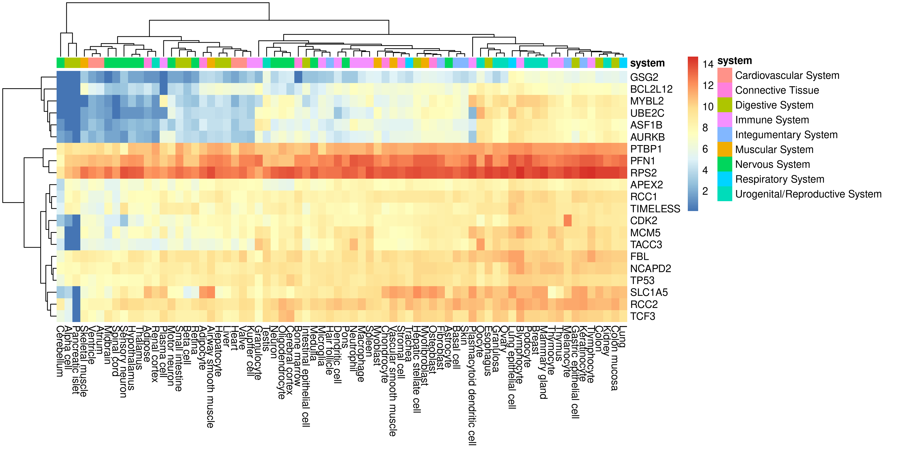

## Table of Contents

- [Gene heatmap using ARCHS4](#gene-heatmap-using-archs4)
  - [Usage](#usage)
  - [Dependencies](#dependencies)
  - [Docker](#docker)
  - [TODO](#todo)
  - [Contact](#contact)

# Gene heatmap using ARCHS4

Create a gene heatmap using data from [ARCHS4](https://maayanlab.cloud/archs4/). The example below retrieves the top 100 (default) most correlated gene expression patterns with _TP53_ using `gget` and plots the results in a heatmap.

```console
./script/plot_heatmap.sh -p 6 TP53
```


Top 20 most correlated with column clustering.

```console
./script/plot_heatmap.sh -p 6 -n 20 -c TP53
```



## Usage

Run the script without any commands to get the usage.

```console
./script/plot_heatmap.sh
```
```
Usage: ./script/plot_heatmap.sh
   [ -p | --max-procs INT (default 8) ]
   [ -t | --tmp-dir STR (default /tmp) ]
   [ -k | --keep keep tmp files ]
   [ -s | --species STR (default human) ]
   [ -n | --num-genes INT (default 100) ]
   [ -c | --cluster-cols ]
   [ -v | --version ]
   [ -h | --help ]
   <HGNC gene symbol>
```

## Dependencies

The script requires [gget](https://github.com/pachterlab/gget).

```console
pip install --upgrade gget
```

The heatmap is plotted using R and the following packages are required for the `heatmap.R` script.

```r
install.packages(c("optparse", "pheatmap", "dplyr", "tidyr"))
```

## Docker

A Docker image with all the dependencies has been created.

```console
docker pull davetang/archs4_heatmap:0.0.4
```

Fetch the 50 most correlated genes to TNF from ARCHS4, and plot the results as a heatmap.

```console
docker run --rm -v $(pwd):$(pwd) -w $(pwd) davetang/archs4_heatmap:0.0.4 -p 4 -n 50 TNF
```


Use `-t` to specify a directory to keep expression data of individual genes.

```console
docker run --rm -v $(pwd):$(pwd) -w $(pwd) davetang/archs4_heatmap:0.0.4 -p 6 -k -t $(pwd) CCL2
```


## TODO

- [ ] Add option to scale by row or column
- [ ] Change colour scale for the different systems since it's hard to distinguish Connective Tissue and Immune System
- [x] Order samples by system instead of performing hierarchical clustering and add gaps in the heatmap to separate systems (added in 0.0.3)
- [x] Fix heatmap dimensions, for when n is small (fixed in 0.0.4)

## Contact

Email <me@davetang.org>.
